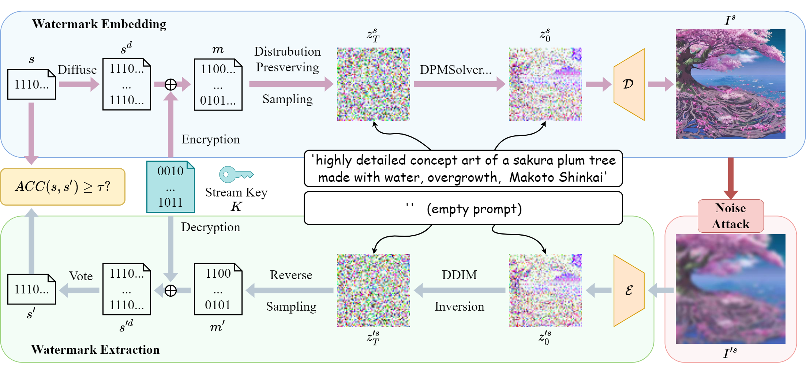

# Gaussian Shading: Provable Performance-Lossless Image Watermarking for Diffusion Models

[](https://arxiv.org/abs/2404.04956)

This repository hosts the official PyTorch implementation of the paper: ["**Gaussian Shading: Provable Performance-Lossless Image Watermarking for Diffusion Models**"](https://arxiv.org/abs/2404.04956) (Accepted by CVPR 2024).


## Method



We propose a watermarking method named Gaussian Shading, designed to ensure no
deterioration in model performance. The embedding process encompasses three primary elements: watermark diffuse, randomization, and distribution-preserving sampling. Watermark diffusion spreads the watermark information throughout the latent representation to enhance the robustness. Watermark randomization and distribution preserving sampling guarantee the congruity of the latent representation distribution with that of watermark-free latent representations, thereby achieving performance-lossless. In the extraction phase, the latent representations are acquired through Denoising Diffusion Implicit Model (DDIM) inversion, allowing for the retrieval of watermark information. 


## Getting Started

### Prerequisites
```
git clone https://github.com/bsmhmmlf/Gaussian-Shading.git
cd Gaussian-Shading
conda create -n gs python=3.8
conda activate gs
pip install -r requirements.txt
```

### Test True Positive Rate and Bit Accuracy

For testing in a lossless situation, you can run,
```
python run_gaussian_shading.py \
      --fpr 0.000001 \
      --channel_copy 1 \
      --hw_copy 8 \
      --chacha \
      --num 1000
```


To test the performance of Gaussian Shading under noise perturbation (e.g., JPEG QF=25), you can run, 
```
python run_gaussian_shading.py \
      --jpeg_ratio 25 \
      --fpr 0.000001 \
      --channel_copy 1 \
      --hw_copy 8 \
      --chacha \
      --num 1000
```
For more adversarial cases, You can refer to [this script](scripts/run.sh).

### Calculate CLIP Score

To calculate the CLIP Score, it relies on two pre-trained models, you can run,
```
python run_gaussian_shading.py \
      --fpr 0.000001 \
      --channel_copy 1 \
      --hw_copy 8 \
      --chacha \
      --num 1000 \
      --reference_model ViT-g-14 \
      --reference_model_pretrain laion2b_s12b_b42k 
```

### Calculate FID

When calculating  FID, we have aligned our settings with [Tree-Ring Watermark](https://github.com/YuxinWenRick/tree-ring-watermark) and used the same ground truth dataset. The dataset contains 5000 images from the COCO dataset. You can find the corresponding information such as prompts in 'fid_outputs/coco/meta_data.json'. 
The ground truth dataset can download [here](https://drive.google.com/drive/folders/1saWx-B3vJxzspJ-LaXSEn5Qjm8NIs3r0?usp=sharing).


Then, to calculate FID, you can run,
```
python gaussian_shading_fid.py \
      --channel_copy 1 \
      --hw_copy 8 \
      --chacha \
      --num 5000 
```


### Additional Notes
- The code is compatible with Stable Diffusion versions 1.4, 2.0, and 2.1, where the latent space size is 4 x 64 x 64. If you want to apply it to other versions of the diffusion model, you will need to adjust the watermark parameters accordingly.

- By default, Gaussian Shading has a capacity of 256 bits. If you want to change the capacity of the watermark, you can adjust `--channel_copy` and `--hw_copy`. 

- Due to the time-consuming nature of Chacha20 encryption, we offer a simple encryption method. It involves using Torch  to generate random bits, which are then XORed with the watermark information directly. By removing  `--chacha ` before running, , you can speed up the testing process. While this method may not be strictly performance-lossless, it is still an improvement over the baseline method mentioned in the paper.


## Acknowledgements
We heavily borrow the code from [Tree-Ring Watermark](https://github.com/YuxinWenRick/tree-ring-watermark). We appreciate the authors for sharing their code. 

## Citation
If you find our work useful for your research, please consider citing the following papers :)

```

@article{yang2024gaussian,
      title={Gaussian Shading: Provable Performance-Lossless Image Watermarking for Diffusion Models}, 
      author={Yang, Zijin and Zeng, Kai and Chen, Kejiang and Fang, Han and Zhang, Weiming and Yu, Nenghai},
      journal={arXiv preprint arXiv:2404.04956},
      year={2024},
}

```
